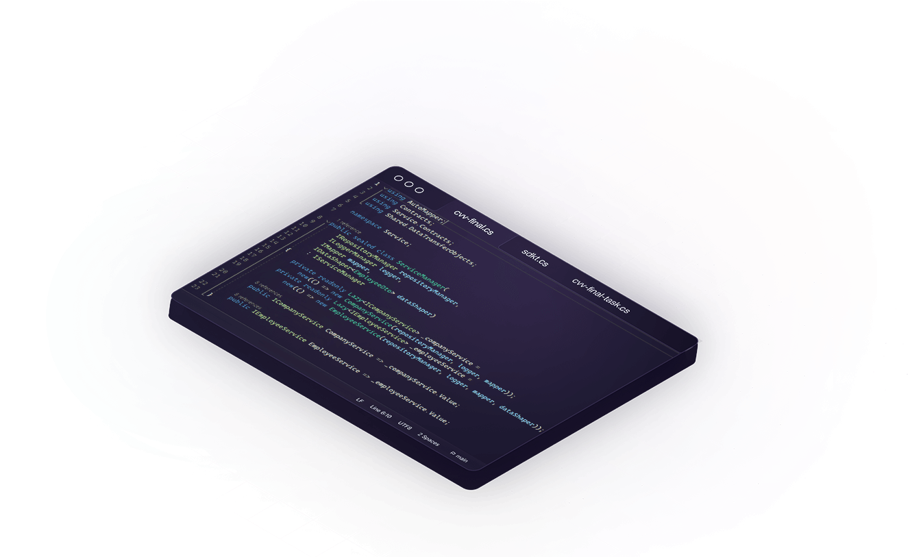

# &lt;Irgi /&gt; | Engineering Interactive Experiences

**"Engineering Intelligent, Scalable, and Robust Software Solutions."**

  <a href="#-about-me">About Me</a> •
  <a href="#-tech-stack">Tech Stack</a> •
  <a href="#-key-highlights">Key Highlights</a> •
  <a href="#-connect">Connect</a>

---

## 👨‍💻 About Me

Hi, I'm **Irgi Adit Pratama**.

I am a **Software Engineer** focused on **AI-Driven Product Innovation**. I don't just build websites; I build interactive systems. My approach combines rigorous engineering principles with creative design to solve complex problems.

Currently focusing on **Next.js**, **React Native**, and exploring the intersection of **Web Technologies and Artificial Intelligence**.

> *"Talk is cheap. Show me the code."* — Linus Torvalds (One of my idols)

---

## 🚀 Why This Portfolio is Different?

This repository isn't just a collection of files; it's a playground of **modern web capabilities**. I built this to push the boundaries of what a "static" portfolio can do.

### 1. 🌌 Immersive 3D Engineering
Instead of flat images, I utilized **React Three Fiber** to render a floating astronaut with mouse-tracking physics. It utilizes `Suspense` and `CanvasLoader` to ensure the 3D model doesn't block the initial UI rendering.

### 2. 🎮 Gamified Interaction (The "Clean Up" Logic)
In the **About Me** section, I implemented a physics-based drag-and-drop system using **Framer Motion**.
* **The Logic:** Elements have momentum and elasticity.
* **The Feature:** Users can "throw" tech stack cards out of the container to clean up the workspace. It turns a boring grid into a mini-game.

### 3. ⚡ Extreme Optimization
As an engineer, performance is non-negotiable.
* **Dynamic Imports:** Heavy sections (Projects, Contact, Globe) are code-split and only loaded when needed.
* **Next/Image:** Fully optimized image rendering with automatic WebP conversion and resizing.
* **Lighthouse Score:** Targeting 90+ Performance on mobile devices.

### 4. 🌍 Global Connectivity
Integrated a WebGL Interactive Globe (`cobe`) to visualize my location and timezone, representing my readiness for remote work worldwide.

---

## 🛠️ Tech Stack

These are the tools I use to bring ideas to life:

| **Core** | **Frontend & UI** | **3D & Animation** | **Backend & Tools** |
| :---: | :---: | :---: | :---: |
|  |  |  |  |
|  |  |  |  |

---

## 📬 Connect

I am open to **freelance work**, **collaborations**, or just discussing **Robotics & AI**.

---

  <i>Crafted with 💤☕ and a lot of &lt;code /&gt; by <b>&lt;Irgi /&gt;</b></i>

